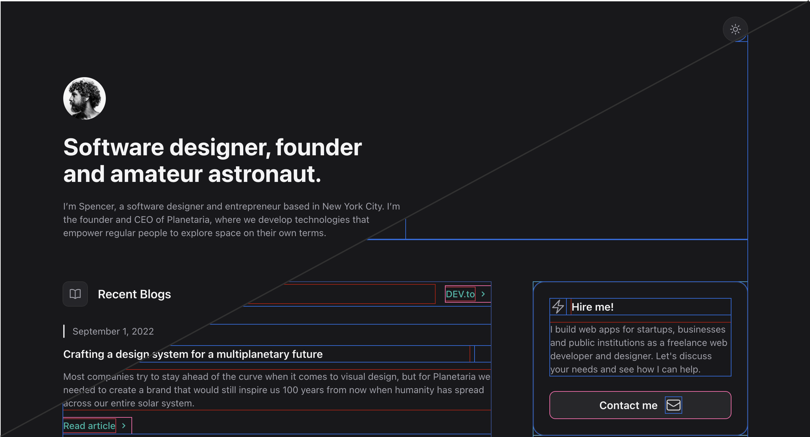

  <!--  -->
  <h1 align="center">Design System for Stage</h1>

[Stage](https://getstage.app/) lets you build your nexyt-gen professional website fast. This Design System are the building blocks which let you build extensions with simple & well-designed components. It also includes documentation and examples of how to extend Stage using React.

## Getting Started

Visit [https://developers.getstage.app](https://developers.getstage.app) to get started with our API. If you want to discover and install extensions, check out [our Store](https://getstage.app/) (soon online).

## Feedback

Stage wouldn't be where it is without the feedback from our community, so we would be happy to hear what you think of the API / Developer Experience and how we can improve. Please use [GitHub issues](https://github.com/stagehq/ui/issues/new/choose) for everything API related (bugs, improvements suggestions, developer experience, docs, etc). We have a overivew [templates](https://developers.getstage.app/api-reference/overview) that should help you get started.